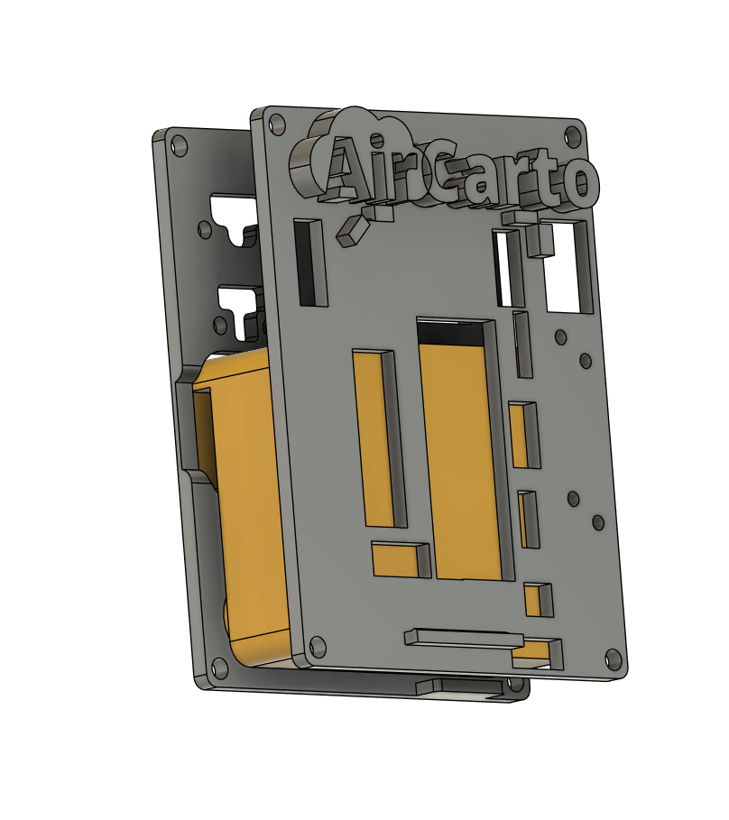
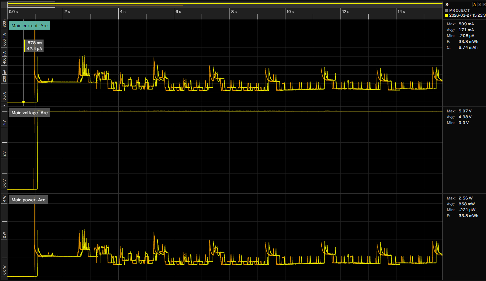

# ModuleAir V4


Version 4 du firmware du **ModuleAir**, la station de mesure de qualité de l'air développée par [AirCarto](https://github.com/aircarto). Ce firmware succède aux versions précédentes ([V2.1](https://github.com/aircarto/ModuleAir_V2.1), [V3](https://github.com/aircarto/ModuleAir_V3)) avec une base de code entièrement réécrite, plus légère et modulaire.

## Hardware

### Board

Board custom basée sur un **ESP32-WROOM-32U** (240 MHz, 16 MB flash, WiFi avec antenne externe).

### Capteurs

| Capteur | Mesure | Interface | Pins (RX/TX ou SDA/SCL) |
|---------|--------|-----------|--------------------------|
| **TERA Sensor NextPM** | Particules fines (PM1, PM2.5, PM10) + temp/hum interne | UART1 (Modbus RTU, 115200 8E1) | IO39 (RX) / IO32 (TX) |
| **MH-Z19** | CO2 (ppm) + température interne | UART2 (9600 8N1) | IO36 (RX) / IO27 (TX) |
| **BME280** | Température, humidité, pression atmosphérique | I2C (0x76 ou 0x77) | IO21 (SDA) / IO22 (SCL) |
| **CCS811 (CJMCU-811)** | COV (TVOC en ppb) et eCO2 (ppm) | I2C (0x5A) | IO21 (SDA) / IO22 (SCL) |
| **SFA40** | Formaldéhyde (HCHO en ppb) | I2C (0x5D) | IO21 (SDA) / IO22 (SCL) |

### Documentation hardware complète

Schematic, PCB, pinout ESP32, connecteurs et BOM : **[docs/HARDWARE.md](docs/HARDWARE.md)**

### Boîtier



Le boîtier est composé d'éléments imprimés en 3D, conçus sur mesure pour accueillir le PCB et les capteurs. Il intègre des ouvertures pour la circulation de l'air (nécessaire aux mesures de particules et de gaz), le passage du câble USB et l'antenne WiFi externe. Le logo AirCarto est directement intégré au design.

## Fonctionnalités

### Mesures

Toutes les 60 secondes (une fois connecté au WiFi), les capteurs sont lus et les valeurs affichées sur le port série :

- **PM1.0, PM2.5, PM10** (µg/m³) — NextPM, moyennes 1 min
- **CO2** (ppm) — MH-Z19
- **Température** (°C), **humidité** (%), **pression** (hPa) — BME280
- **TVOC** (ppb), **eCO2** (ppm) — CCS811
- **HCHO** (ppb) — SFA40 (formaldéhyde)

### Envoi des données

Les données sont envoyées toutes les **60 secondes** vers le serveur AirCarto au format JSON avec les codes ISO LCSQA :

```
https://data.moduleair.fr/wifi_newDriver2026.php?device_type=ModuleAir
```

| Mesure | Code ISO |
|--------|----------|
| PM1.0 | ISO_68 |
| PM2.5 | ISO_39 |
| PM10 | ISO_24 |
| CO2 | ISO_17 |
| Température | ISO_54 |
| Humidité | ISO_55 |
| Pression | ISO_53 |
| TVOC | ISO_100 |
| eCO2 | ISO_101 |
| HCHO | ISO_VB |

#### Structure complète du JSON

```json
{
  "device_id": "AABBCCDDEEFF",
  "signal_quality": -52,
  "signal_quality_unit": "-52 dB",
  "version": 1,
  "version_major": 0,
  "version_minor": 0,
  "version_patch": 1,
  "ISO_68": 3.2,           // PM1.0 (si pm_ok)
  "ISO_68_unit": "3.2 ugm3",
  "ISO_39": 5.1,           // PM2.5 (si pm_ok)
  "ISO_39_unit": "5.1 ugm3",
  "ISO_24": 7.8,           // PM10 (si pm_ok)
  "ISO_24_unit": "7.8 ugm3",
  "ISO_54": 22.3,          // Température (si bme_ok)
  "ISO_54_unit": "22.3 °C",
  "ISO_55": 45.2,          // Humidité (si bme_ok)
  "ISO_55_unit": "45.2 %",
  "ISO_53": 1013.5,        // Pression (si bme_ok)
  "ISO_53_unit": "1013.5 hPa",
  "ISO_17": 420,           // CO2 (si co2_ok)
  "ISO_17_unit": "420 ppm",
  "ISO_100": 35,           // TVOC (si ccs_ok)
  "ISO_100_unit": "35 ppb",
  "ISO_101": 410,          // eCO2 (si ccs_ok)
  "ISO_101_unit": "410 ppm",
  "ISO_VB": 8.5,           // HCHO (si sfa40_ok)
  "ISO_VB_unit": "8.5 ppb",
  "error_flags": 0,
  "npm_status": 0,
  "device_status": 2
}
```

> Les champs de mesure (ISO_*) sont **omis** du JSON lorsque le capteur correspondant est en erreur. Les champs `error_flags`, `npm_status` et `device_status` sont toujours présents.

#### Champs de diagnostic

**`error_flags`** — bitmask indiquant les capteurs en erreur :

| Bit | Valeur | Signification |
|-----|--------|---------------|
| 2 | `0x04` | BME280 en erreur (température/humidité/pression) |
| 3 | `0x08` | NextPM en erreur (particules fines) |
| 4 | `0x10` | CCS811 en erreur (TVOC/eCO2) |
| 5 | `0x20` | SFA40 en erreur (HCHO) |
| 7 | `0x80` | MH-Z19 en erreur (CO2) |

Exemples : `0` = tous les capteurs OK, `0x88` (136) = NextPM + MH-Z19 en erreur.

**`npm_status`** — registre de statut interne du NextPM (registre Modbus 0x13), transmis tel quel. `0xFF` = pas encore lu.

**`device_status`** — bitmask d'état du device :

| Bit | Valeur | Signification |
|-----|--------|---------------|
| 1 | `0x02` | WiFi connecté (toujours vrai dans le JSON, l'envoi nécessite le WiFi) |
| 7 | `0x80` | Boot récent (uptime < 5 minutes) |

### WiFi Manager

Au premier démarrage, le capteur crée un point d'accès WiFi :

- **SSID** : `ModuleAir-XXXXXX` (les 6 derniers caractères du MAC, unique par capteur)
- **Mot de passe** : `moduleaircfg`

La page de configuration s'ouvre automatiquement à la connexion (captive portal). Une fois connecté au WiFi, la page devient un dashboard affichant les dernières mesures, l'état des capteurs et les infos système. Elle est accessible via l'IP locale ou `http://moduleair.local`.

### Identification

Chaque capteur possède un identifiant unique basé sur l'adresse MAC de l'ESP32 :

- **Device ID** : `AABBCCDDEEFF` (utilisé pour l'identification sur les serveurs)

### Mise à jour OTA

Le firmware peut être mis à jour à distance (Over-The-Air) depuis le dashboard web :

1. Sur le dashboard, cliquer **"Vérifier les mises à jour"**
2. Si une nouvelle version est disponible, confirmer la mise à jour
3. Le capteur télécharge le firmware, l'installe et redémarre automatiquement

Le serveur OTA (`gestion.aircarto.fr`) héberge `version.txt` et `firmware.bin` par type de device. Le capteur envoie son Device ID en query param (`?sensor=AABBCCDDEEFF`) pour permettre le suivi des mises à jour.

#### Publier une mise à jour OTA

Pour publier une nouvelle version du firmware sur le serveur OTA, il suffit de compiler le projet (pas besoin de capteur branché) :

```bash
pio run
```

Le script `ota_upload.py` est déclenché automatiquement en post-build et uploade `firmware.bin` + le numéro de version vers `gestion.aircarto.fr`. Les capteurs sur le terrain pourront ensuite récupérer la mise à jour depuis leur dashboard.

**Configuration requise** : créer un fichier `ota_config.ini` à la racine du projet (non versionné, contient la clé API) :

```ini
[ota]
server = https://gestion.aircarto.fr/api
device = ModuleAir
api_key = VOTRE_CLE_API
```

**Upload manuel** (sans PlatformIO) :

```bash
python ota_upload.py -d ModuleAir -v 0.0.1 -k VOTRE_CLE_API
```

## Consommation électrique



Mesure réalisée sur USB 5V avec un power profiler (capture de ~15 secondes en fonctionnement normal) :

| Paramètre | Valeur |
|-----------|--------|
| **Tension d'alimentation** | 5.0 V (avg) |
| **Courant moyen** | 171 mA |
| **Courant max (pic)** | 509 mA |
| **Puissance moyenne** | 858 mW |
| **Puissance max (pic)** | 2.56 W |

### Analyse du profil

- **Baseline** : le courant de repos se situe autour de **100–150 mA**, correspondant à l'ESP32 actif avec le WiFi maintenu
- **Pics périodiques** (300–509 mA) : transmissions WiFi (envoi de données, maintien de connexion) et lectures des capteurs (NextPM via Modbus, MH-Z19 via UART, BME280/CCS811 via I2C)
- **Pic au démarrage** (~1 s) : initialisation de l'ESP32, connexion WiFi et démarrage des capteurs

### Estimation de consommation journalière

| Métrique | Valeur |
|----------|--------|
| Consommation moyenne | ~0.86 W |
| Consommation journalière | ~20.6 Wh/jour |
| Consommation annuelle | ~7.5 kWh/an |

Le capteur est conçu pour une alimentation permanente sur USB 5V (chargeur ou port USB). Un adaptateur secteur standard de 5V/1A est suffisant.

## Structure du code

```
src/
  config.h / config.cpp         → pins, constantes, version, device ID
  sensors.h / sensors.cpp       → init et lecture des capteurs
  wifi_manager.h / wifi_manager.cpp → WiFi, AP, serveur web, mDNS, OTA
  data_sender.h / data_sender.cpp   → envoi des données vers le serveur
  main.cpp                      → orchestrateur (setup/loop)
```

## Développement

### Prérequis

- [PlatformIO](https://platformio.org/)
- ESP32 connecté en USB

### Compiler et flasher

```bash
pio run -t upload
```

### Moniteur série

```bash
pio device monitor
```

## Versioning

Ce projet suit le [Semantic Versioning](https://semver.org/) : `MAJOR.MINOR.PATCH`

- **MAJOR** : changement non rétrocompatible (nouveau protocole, restructuration complète)
- **MINOR** : ajout de fonctionnalité (nouveau capteur, WiFi, OTA...)
- **PATCH** : correction de bug, ajustement mineur

La version est définie dans `src/config.h` via `FIRMWARE_VERSION` et affichée au démarrage sur le port série.
