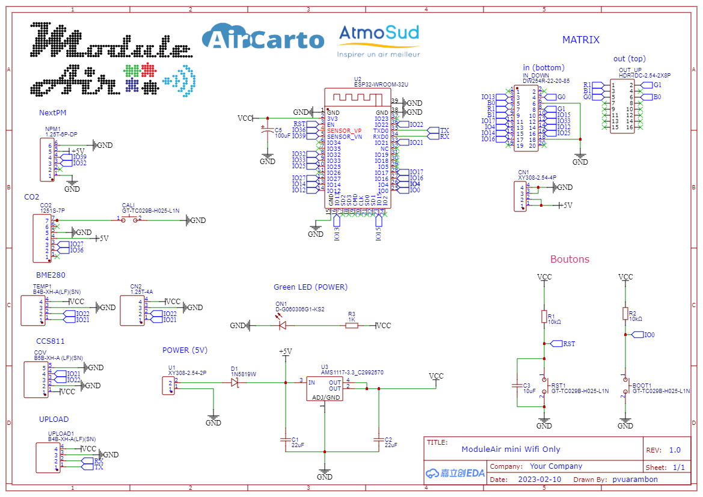
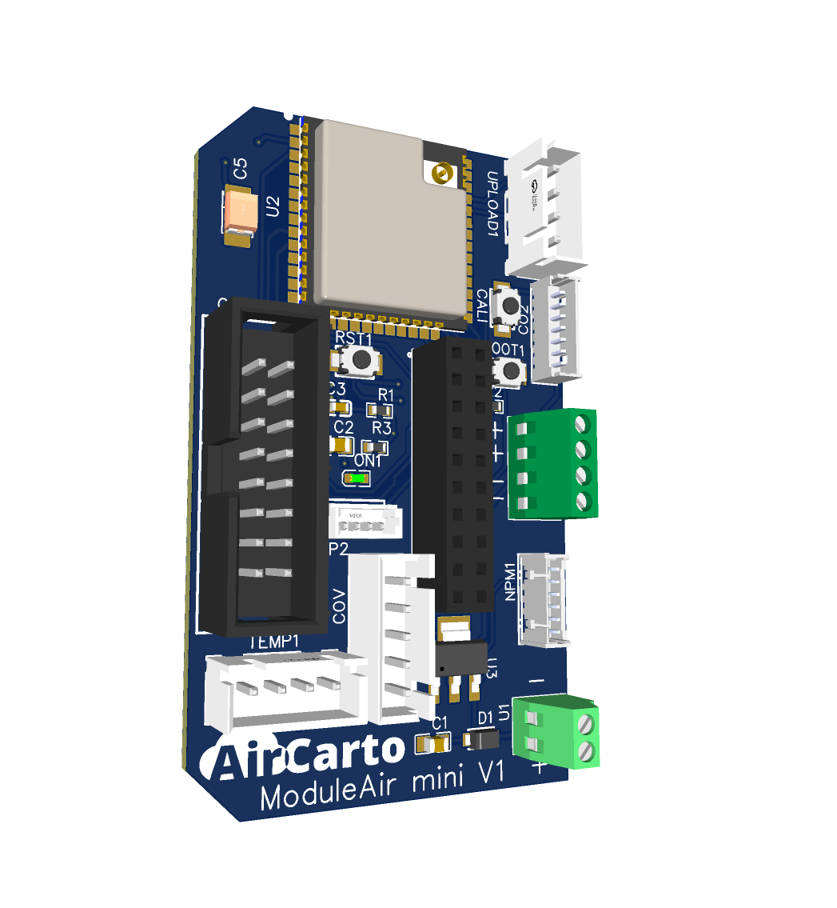

# Hardware — ModuleAir Mini WiFi V1

Documentation technique de la board custom **ModuleAir Mini WiFi V1**, conçue autour d'un ESP32-WROOM-32U.

## Schematic

## Vue 3D du PCB

## Alimentation

| Composant | Ref | Description |
|-----------|-----|-------------|
| **AMS1117-3.3** | U3 | Régulateur LDO 3.3V (SOT-223) |
| **1N5819W** | D1 | Diode Schottky de protection (SOD-123F) |
| **100uF** | C5 | Condensateur de découplage entrée |
| **22uF** | C1, C2 | Condensateurs de découplage sortie 3.3V |
| **10uF** | C3 | Condensateur de filtrage |

Tension d'entrée : **5V** via USB ou bornier CN1. Le régulateur AMS1117-3.3 alimente l'ESP32 et les capteurs en 3.3V.

## Microcontrôleur

| Paramètre | Valeur |
|-----------|--------|
| Module | **ESP32-WROOM-32U-N4** (U2) |
| CPU | Dual-core Xtensa LX6, 240 MHz |
| Flash | 4 MB |
| RAM | 520 KB SRAM |
| WiFi | 802.11 b/g/n, antenne externe (connecteur U.FL) |

## Pinout ESP32

### UART1 — NextPM (particules fines, Modbus RTU 115200 8E1)

| Signal | GPIO | Connecteur |
|--------|------|------------|
| RX | IO39 | NPM1 (1.25mm 6P) |
| TX | IO32 | NPM1 |

### UART2 — MH-Z19 (CO2, 9600 8N1)

| Signal | GPIO | Connecteur |
|--------|------|------------|
| RX | IO36 | CO2 (1.25mm 7P) |
| TX | IO27 | CO2 |

### I2C — BME280 + CCS811

| Signal | GPIO | Connecteurs |
|--------|------|-------------|
| SDA | IO21 | TEMP1 (XH 4P), COV (XH 5P) |
| SCL | IO22 | TEMP1, COV |

### Ecran Matrix LED (HUB75, SPI HSPI)

L'écran est un **panneau RGB HUB75 de 64x32 pixels**, disponible en deux tailles :

| Variante | Pitch | Dimensions |
|----------|-------|------------|
| **P2.5** | 2.5 mm | 160 x 80 mm |
| **P3** | 3.0 mm | 192 x 96 mm |

Le panneau est piloté par la bibliothèque [PxMatrix](https://github.com/2dom/PxMatrix) (v1.8.2+), basée sur Adafruit GFX, via le bus **HSPI** de l'ESP32.

**Pins SPI (HSPI)** :

| Signal | GPIO |
|--------|------|
| SPI_CLK | IO14 |
| SPI_MOSI | IO13 |
| SPI_MISO | IO12 |
| SPI_SS | IO4 |

**Pins de controle HUB75** :

| Signal | GPIO | Fonction |
|--------|------|----------|
| P_LAT | IO25 | Latch (strobe) |
| P_A | IO17 | Selection de ligne |
| P_B | IO33 | Selection de ligne |
| P_C | IO4 | Selection de ligne |
| P_D | IO12 | Selection de ligne |
| P_E | IO15 | Selection de ligne |
| P_OE | IO16 | Output Enable |

**Configuration** :

| Parametre | Valeur |
|-----------|--------|
| Resolution | 64 x 32 pixels |
| Scan rate | 1/16 |
| Profondeur couleur | 4 bits par canal |
| Driver chip | SHIFT (shift register standard) |
| Ordre couleurs | RRBBGG (P2.5) / RRGGBB (P3) |
| Frequence SPI | 20 MHz |
| Refresh ISR | Timer hardware ESP32, toutes les 4 ms |

> **Note** : Le bus HSPI est utilise (et non VSPI) pour eviter les conflits avec d'autres peripheriques SPI. Cela necessite une version modifiee de PxMatrix qui utilise `SPI_H(HSPI)` au lieu de `SPI(VSPI)`.

## Connecteurs

| Ref | Type | Broches | Usage |
|-----|------|---------|-------|
| **CN1** | XY308 bornier à vis 2.54mm | 4P | Alimentation 5V |
| **U1** | XY308 bornier à vis 2.54mm | 2P | Alimentation secondaire |
| **NPM1** | 1.25mm pas fin | 6P | Capteur NextPM (UART + alim) |
| **CO2** | 1.25mm pas fin | 7P | Capteur MH-Z19 (UART + alim) |
| **COV** | JST XH 2.5mm | 5P | Capteur CCS811 (I2C + alim) |
| **TEMP1** | JST XH 2.5mm | 4P | Capteur BME280 (I2C + alim) |
| **UPLOAD1** | JST XH 2.5mm | 4P | Port de programmation/debug |
| **CN2** | 1.25mm pas fin | 4P | Connecteur auxiliaire |
| **IN_DOWN** | Header 2.54mm | 2x10P (20 pins) | Header bas ESP32 (pass-through) |
| **OUT_UP** | IDC 2.54mm | 2x8P (16 pins) | Header haut ESP32 (extension) |

## Boutons

| Ref | Fonction | Description |
|-----|----------|-------------|
| **BOOT1** | Boot / Flash | Maintenir enfoncé au démarrage pour entrer en mode flash |
| **RST1** | Reset | Redémarrage de l'ESP32 |
| **CALI** | Calibration | Bouton de calibration capteurs |

## LED indicatrice

| Ref | Type | Description |
|-----|------|-------------|
| **ON1** | LED CMS 0603 (verte) | Indicateur d'alimentation, via R3 (1K) |

## Composants passifs

| Ref | Valeur | Package | Quantite | Role |
|-----|--------|---------|----------|------|
| R1, R2 | 10K | 0603 | 2 | Pull-up I2C / strapping |
| R3 | 1K | 0603 | 1 | Resistance LED ON1 |
| C1, C2 | 22uF | 0805 | 2 | Decouplage regulateur |
| C3 | 10uF | 0603 | 1 | Filtrage |
| C5 | 100uF | CMS electrolytique | 1 | Decouplage entree |

## BOM (Bill of Materials)

| # | Composant | Ref PCB | Quantite | Fournisseur | Part # |
|---|-----------|---------|----------|-------------|--------|
| 1 | Bouton tactile GT-TC029B | BOOT1, CALI, RST1 | 3 | LCSC | C843669 |
| 2 | Condensateur 22uF 0805 | C1, C2 | 2 | LCSC | C602037 |
| 3 | Condensateur 10uF 0603 | C3 | 1 | LCSC | C19702 |
| 4 | Condensateur 100uF CMS | C5 | 1 | LCSC | C140381 |
| 5 | Bornier XY308 4P 2.54mm | CN1 | 1 | LCSC | C915913 |
| 6 | Connecteur 1.25mm 4P | CN2 | 1 | LCSC | C145972 |
| 7 | Connecteur 1.25mm 7P | CO2 | 1 | LCSC | C220125 |
| 8 | Connecteur JST XH 5P | COV | 1 | LCSC | C157991 |
| 9 | Diode Schottky 1N5819W | D1 | 1 | LCSC | C169540 |
| 10 | Header 2x10P 2.54mm | IN_DOWN | 1 | LCSC | C2935991 |
| 11 | Connecteur 1.25mm 6P | NPM1 | 1 | LCSC | C145933 |
| 12 | LED verte 0603 | ON1 | 1 | LCSC | C118334 |
| 13 | Header IDC 2x8P 2.54mm | OUT_UP | 1 | LCSC | C3406 |
| 14 | Resistance 10K 0603 | R1, R2 | 2 | LCSC | C25804 |
| 15 | Resistance 1K 0603 | R3 | 1 | LCSC | C328422 |
| 16 | Connecteur JST XH 4P | TEMP1, UPLOAD1 | 2 | LCSC | C144395 |
| 17 | Bornier XY308 2P 2.54mm | U1 | 1 | LCSC | C557685 |
| 18 | ESP32-WROOM-32U-N4 | U2 | 1 | LCSC | C328062 |
| 19 | AMS1117-3.3 LDO | U3 | 1 | LCSC | C2992570 |

**Cout total composants** : ~6.50 USD (hors PCB et capteurs)
