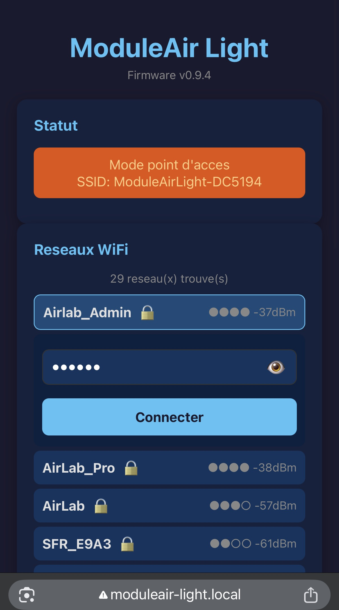
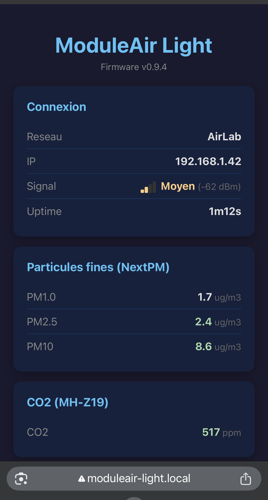
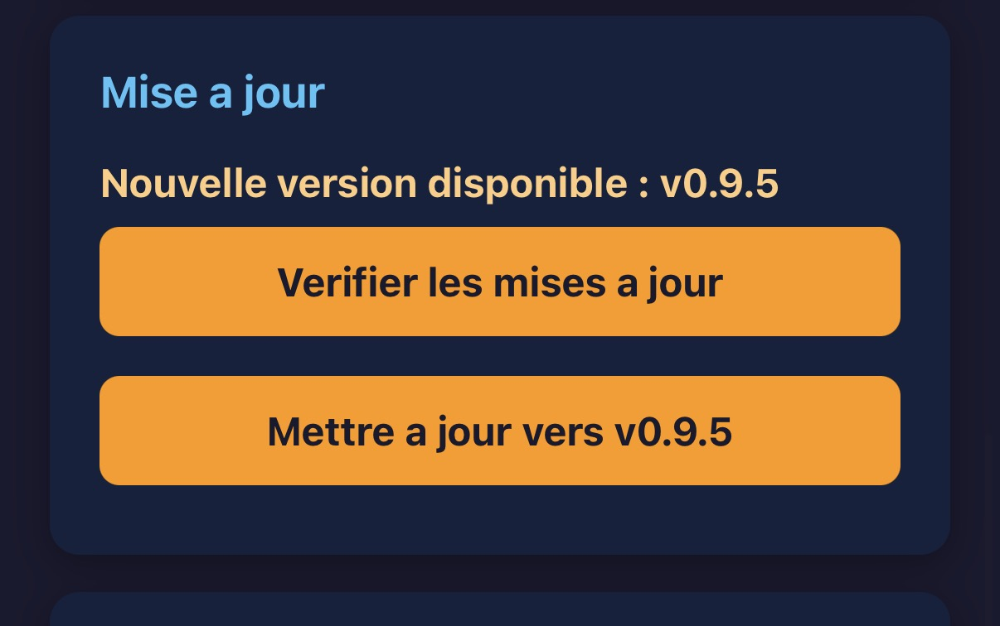

# ModuleAir Light — Guide utilisateur

## 1. Connecter le capteur à votre WiFi

### Brancher le capteur

Branchez le capteur sur une prise USB (chargeur de téléphone, port USB d'une box...). Le capteur démarre automatiquement.

Au démarrage, les LEDs jouent une courte animation arc-en-ciel puis passent en **respiration orange** : le capteur est prêt à être configuré.

### Se connecter au réseau du capteur

Sur votre téléphone ou ordinateur, ouvrez les paramètres WiFi et connectez-vous au réseau :

- **Nom du réseau** : `ModuleAirLight-XXXXXX` (les 6 derniers caractères sont propres à votre capteur)
- **Mot de passe** : `moduleaircfg`

### Configurer le WiFi

Une page de configuration s'ouvre automatiquement (captive portal). Si ce n'est pas le cas, ouvrez votre navigateur à n'importe quelle adresse.

> **Important** : le capteur ne peut se connecter qu'à un réseau WiFi classique protégé par un mot de passe (WPA/WPA2). Les réseaux d'entreprise avec portail captif ou identifiant/mot de passe (type université, hôtel, bureau) ne sont pas supportés.

Sur cette page :

1. Repérez votre réseau WiFi dans la liste (cliquez sur "Actualiser les réseaux" si besoin)
2. Cliquez sur le nom de votre réseau
3. Entrez le mot de passe de votre box WiFi
4. Cliquez sur **Connecter**



### Vérifier la connexion

Le capteur tente de se connecter à votre box. Si la connexion réussit :

- Les LEDs passent en **clignotement bleu rapide** pendant quelques secondes
- Puis elles s'éteignent : le capteur fonctionne normalement

Si la connexion échoue, les LEDs repassent en **respiration orange** et vous pouvez réessayer.

Une fois connecté, le capteur envoie automatiquement les mesures de qualité de l'air toutes les 60 secondes. La configuration est mémorisée : au prochain branchement, le capteur se connectera automatiquement à votre box.

## 2. Utiliser le dashboard

### Accéder au dashboard

Une fois le capteur connecté à votre WiFi, vous pouvez accéder à son interface depuis n'importe quel appareil connecté au même réseau.

Ouvrez un navigateur et tapez :

```
http://moduleair-light.local
```

> **Si l'adresse ne fonctionne pas** : certains appareils (notamment sous Android) ne supportent pas les adresses `.local`. Dans ce cas, vous pouvez utiliser l'adresse IP du capteur (visible dans l'interface d'administration de votre box).



### Consulter les mesures

Le dashboard affiche en temps réel les dernières mesures du capteur :

- **Particules fines** (PM1, PM2.5, PM10) — qualité de l'air
- **CO2** — niveau de CO2 dans l'air
- **COV** — composés organiques volatils
- **Température**, **humidité**, **pression atmosphérique**

Les valeurs sont colorées selon leur niveau : **vert** (bon), **orange** (moyen), **rouge** (mauvais).

### Gérer les LEDs

Le dashboard permet de contrôler les LEDs du capteur :

- **Allumer / Éteindre** les LEDs
- **Régler la luminosité** avec le curseur (de 5 à 255)

Ces réglages sont conservés même après un redémarrage du capteur.

> **Note** : les LEDs d'erreur (rouge, orange, violet) s'affichent toujours, même si vous avez éteint les LEDs. Elles disparaissent automatiquement quand la situation revient à la normale.

### Mettre à jour le capteur

Le capteur peut se mettre à jour automatiquement par internet :

1. Sur le dashboard, cliquez sur **"Vérifier les mises à jour"**
2. Si une nouvelle version est disponible, confirmez la mise à jour
3. Le capteur télécharge le nouveau firmware, l'installe et redémarre automatiquement



La mise à jour prend environ 30 secondes. Le dashboard redevient accessible une fois le capteur redémarré.

### Autres options

- **Oublier le WiFi** : le capteur efface le réseau mémorisé et repasse en mode configuration (respiration orange). Utile si vous changez de box ou de mot de passe WiFi.
- **Redémarrer le capteur** : force un redémarrage complet.

## 3. Comprendre les LEDs

Les LEDs indiquent l'état du capteur à tout moment :

| LEDs | Signification |
|------|---------------|
| Animation arc-en-ciel | Le capteur démarre |
| Respiration orange | En attente de configuration WiFi |
| Clignotement bleu rapide (5s) | Connexion WiFi réussie |
| LEDs éteintes | Tout fonctionne normalement |
| Flash bleu vif | Lecture des capteurs en cours |
| Damier rouge clignotant | WiFi perdu — le capteur tente de se reconnecter |
| Damier orange clignotant | WiFi connecté mais pas d'accès internet |
| Damier violet clignotant | Internet OK mais le serveur de données ne répond pas |

> En fonctionnement normal, les LEDs sont éteintes par défaut. Vous pouvez les activer depuis le dashboard.
